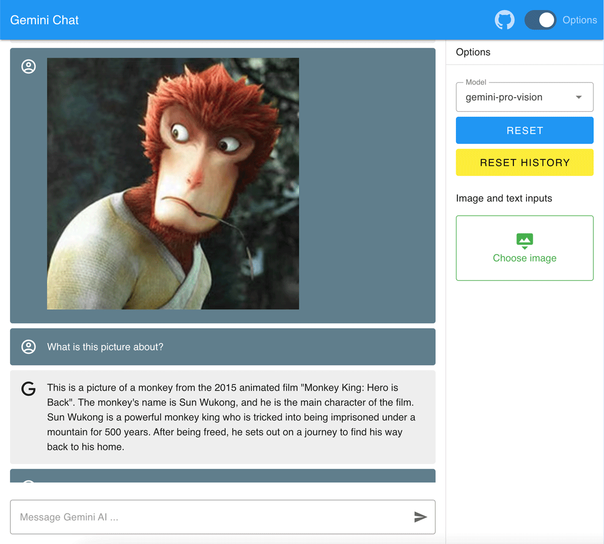

# chat-google-gemini


Chat demo developed using Google AI Gemini API. https://ai.google.dev/



## Setup

### Create and enable virtual environments

```bash
# create
python -m venv .venv

# enable
# Mac
source .venv/bin/activate
# Windows
.venv\Scripts\activate

# Mac log
(.venv) (base) username@PC-name folder-name
```

<details>
<summary>or VSCode settings</summary>

Create or update `.vscode/settings.json`

```json
{
  "python.terminal.activateEnvironment": true
}
```
</details>

### Install dependencies

```bash
pip install -r requirements.txt
```

### Create `.env` file

copy `.env.example` and rename, or create new `.env` file

```
# Google api key
GOOGLE_API_KEY=ai_api_key_xxxxxxx
```

### Start service

```bash
uvicorn main:app --reload
```

## Other

https://vuejs.org/

https://vuetifyjs.com/

